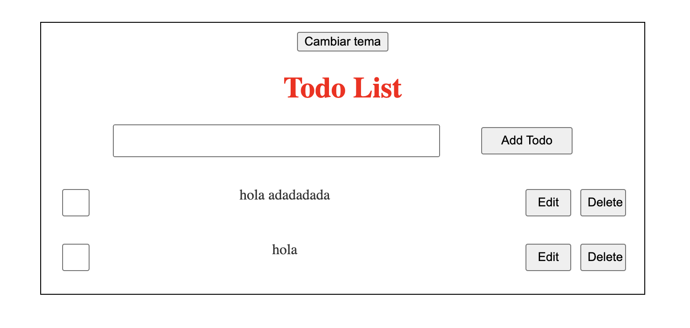
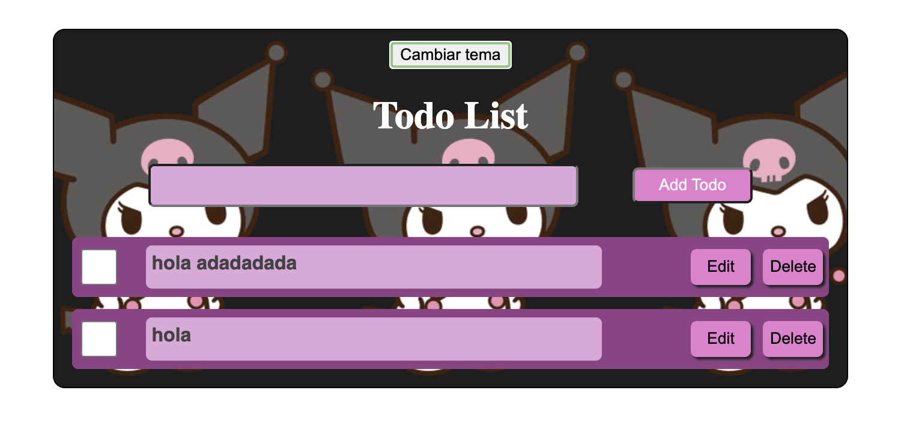

# Todo List

En esta ocacion se realizo un TODO list con diferentes opciones utilizando diferentes hooks de react.

Una ves realizado el proyecto de todoList, se procedio a realizar un cambio de tema mediante un boton, utilizando el hook de useContext.

## Project setup

```
npm install
```

### Compiles and hot-reloads for development

```
npm run dev
```

## Imagenes del proyecto

### Sin tema


###  Tema Kuromi



### React + Vite

This template provides a minimal setup to get React working in Vite with HMR and some ESLint rules.
