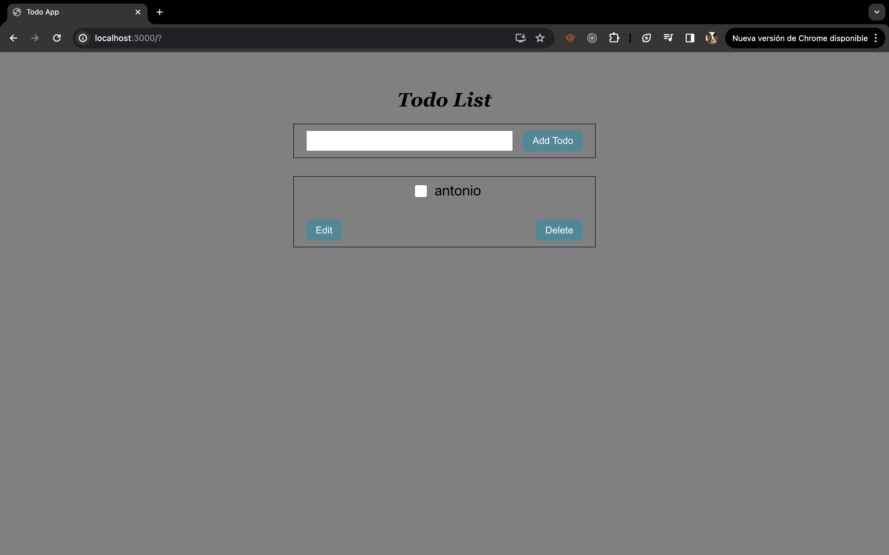
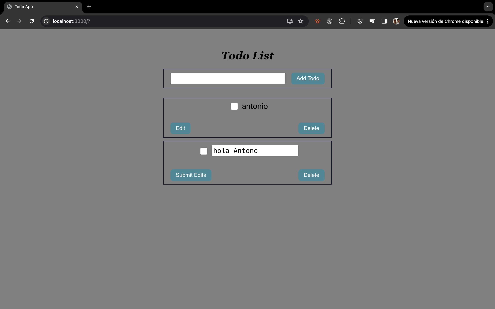

# Reporte de Código: Aplicación de Lista de Tareas
Este código es una aplicación de lista de tareas (o "todo list") simple construida con React. A continuación, se detalla cómo funciona y cómo se elaboró.

Funcionamiento
El código se basa en el uso de React y su sistema de estados para manejar la lista de tareas. Se utilizan dos estados principales: todos y todoEditing.

- todos: Este estado almacena la lista actual de tareas. Cada tarea es un objeto con tres propiedades: id, text y completed.
- todoEditing: Este estado se utiliza para almacenar el ID de la tarea que se está editando actualmente.

El código también incluye dos funciones principales: handleSubmit y deleteToDo.

- handleSubmit: Esta función se activa cuando el usuario envía el formulario para agregar una nueva tarea. Crea un nuevo objeto de tarea, verifica que el texto de la tarea no esté vacío y luego agrega la nueva tarea a la lista de tareas.
- deleteToDo: Esta función se activa cuando el usuario desea eliminar una tarea. Filtra la lista de tareas para eliminar la tarea con el ID especificado.

## Elaboración
El código se elaboró utilizando el enfoque de desarrollo de componentes de React. Primero, se crearon los estados y las funciones necesarias. Luego, se implementó el código JSX para la interfaz de usuario, que incluye un formulario para agregar nuevas tareas y una lista de las tareas actuales.

El código se escribió de manera que sea fácil de entender y mantener. Se utilizó el método useState de React para crear los estados, y se utilizó el método useEffect para manejar los efectos secundarios (aunque en este fragmento de código no se muestra su uso).

En resumen, este código es un ejemplo de cómo se puede utilizar React para crear una aplicación de lista de tareas simple pero funcional.

# Explicación de [...todos]
En JavaScript, [...todos] es una sintaxis que se conoce como operador de propagación (o spread operator). Este operador crea una copia de un array existente y puede ser útil cuando quieres modificar un array sin alterar el original.

En el contexto de este código, [...todos] se utiliza para crear una copia del estado actual de todos (que es un array de tareas). Luego, esta copia se modifica (por ejemplo, agregando una nueva tarea o eliminando una tarea existente) y se utiliza para actualizar el estado de todos.

Esto es importante en React porque los estados son inmutables, lo que significa que no puedes modificarlos directamente. En lugar de eso, debes crear una copia del estado, modificar esa copia y luego utilizar setState para actualizar el estado con la nueva copia.

Por ejemplo, en la función handleSubmit, se utiliza [...todos].concat(newTodo) para crear una nueva lista de tareas que incluye la tarea recién creada. En la función deleteToDo, se utiliza [...todos].filter((todo) => todo.id !== id) para crear una nueva lista de tareas que no incluye la tarea que se desea eliminar. En ambos casos, setTodos se utiliza para actualizar el estado de todos con la nueva lista de tareas.

## imagenes

